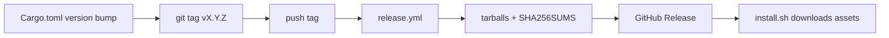

# Releasing `kotonoha` CLI

Release binaries are **built in CI** and published to **GitHub Releases only**. They are **never** committed to this repository.

## Automated flow



| Step | Action |
| --- | --- |
| 1 | Bump `version` in `Cargo.toml` and update `CHANGELOG.md` |
| 2 | Merge to `main` |
| 3 | `git tag vX.Y.Z && git push origin vX.Y.Z` |
| 4 | Wait for [Release workflow](.github/workflows/release.yml) (Actions tab) |
| 5 | Confirm assets on the Release page |

### Published assets

| File | Description |
| --- | --- |
| `kotonoha-vX.Y.Z-linux-amd64.tar.gz` | Linux x86_64 binary |
| `kotonoha-vX.Y.Z-macos-arm64.tar.gz` | macOS Apple Silicon binary |
| `SHA256SUMS` | Checksums for all tarballs |

Naming must match [`scripts/install.sh`](scripts/install.sh).

### Tag rule

The git tag **must** equal `v` + `Cargo.toml` `version`:

```bash
./scripts/check-release-tag.sh v0.2.9
```

CI runs this check before building.

## Local packaging (maintainers)

To test packaging without publishing:

```bash
cargo build --release --target x86_64-unknown-linux-gnu   # or native target
./scripts/package-release.sh v0.2.9-test linux-amd64 \
  target/x86_64-unknown-linux-gnu/release/kotonoha
```

The resulting `*.tar.gz` is gitignored (`dist/`, `*.tar.gz`).

## Manual workflow dispatch

For dry-run validation of the build matrix (creates a Release when run on a tag ref):

1. Actions → **Release** → **Run workflow**
2. Enter tag `vX.Y.Z` matching `Cargo.toml`

Prefer normal tag push for production releases.

## Installer smoke test

After a release is published:

```bash
curl -fsSL https://raw.githubusercontent.com/zyx-corporation/kotonoha-cli/main/scripts/install.sh \
  | bash -s -- --version vX.Y.Z --method binary
export PATH="$HOME/.local/bin:$PATH"
kotonoha version
```

## Documentation

- User install: [kotonoha-docs — install_kotonoha_cli.md](https://github.com/zyx-corporation/kotonoha-docs/blob/main/ja/tutorials/install_kotonoha_cli.md)
- Maintainer detail: [cli_installer_implementation.md](https://github.com/zyx-corporation/kotonoha-docs/blob/main/ja/manual/cli_installer_implementation.md)
